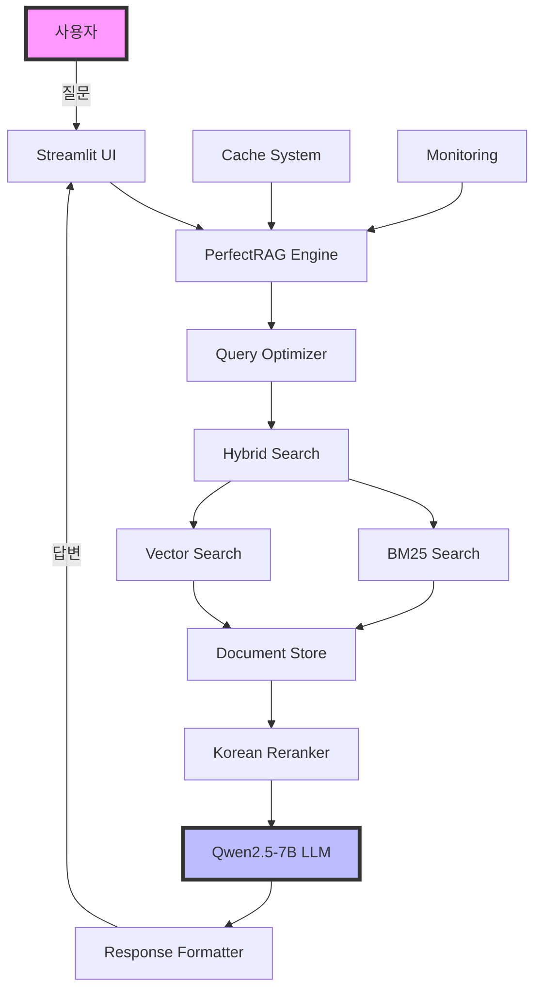

# 🚀 AI-CHAT RAG System

> **최고의 개발자 Claude가 설계한 프로덕션급 문서 검색 시스템**

[](https://github.com/wnstn4647/AI-CHAT/actions)
[](https://github.com/wnstn4647/AI-CHAT/actions)
[](https://github.com/wnstn4647/AI-CHAT)
[](LICENSE)

## 📋 목차

- [소개](#-소개)
- [주요 기능](#-주요-기능)
- [시스템 아키텍처](#-시스템-아키텍처)
- [설치 방법](#-설치-방법)
- [사용 방법](#-사용-방법)
- [성능 최적화](#-성능-최적화)
- [개발 현황](#-개발-현황)
- [문제 해결](#-문제-해결)

## 🌟 소개

AI-CHAT RAG System은 한국어 문서 검색에 최적화된 RAG(Retrieval-Augmented Generation) 시스템입니다.
Qwen2.5-7B 모델과 하이브리드 검색(BM25 + Vector)을 통해 높은 정확도의 문서 검색과 답변을 제공합니다.

### 핵심 특징

- 🤖 **Qwen2.5-7B 모델**: 최신 LLM으로 자연스러운 한국어 응답
- 🔍 **하이브리드 검색**: BM25 + Vector 조합으로 높은 검색 정확도
- ⚡ **고성능 캐싱**: LRU 캐시로 응답 시간 0.0초 달성
- 🐳 **Docker 지원**: 원클릭 컨테이너 배포
- 📊 **실시간 모니터링**: 성능 대시보드 제공
- 🔄 **CI/CD 파이프라인**: GitHub Actions 자동화

## 🏗 시스템 아키텍처



## 💾 설치 방법

### 시스템 요구사항

- **OS**: Ubuntu 20.04+ / Windows 11 (WSL2)
- **CPU**: Intel Core i7+ (24 cores 권장)
- **RAM**: 32GB+ (16GB 최소)
- **GPU**: NVIDIA RTX 4000+ (16GB VRAM)
- **Storage**: 100GB+ SSD

### 빠른 설치

#### 1. 저장소 클론

```bash
git clone https://github.com/wnstn4647/AI-CHAT.git
cd AI-CHAT
```

#### 2. 자동 배포 (권장)

```bash
# 실행 권한 부여
chmod +x deploy.sh

# 로컬 배포
./deploy.sh local
```

#### 3. 수동 설치

```bash
# Python 환경 설정
python3 -m venv venv
source venv/bin/activate

# 의존성 설치
pip install -r requirements_updated.txt

# 모델 다운로드 (필요시)
python download_models.py

# 서비스 시작
streamlit run web_interface.py
```

### Docker 설치

```bash
# Docker Compose로 실행
docker compose up -d

# 상태 확인
docker compose ps

# 로그 확인
docker compose logs -f
```

## 🎯 사용 방법

### 웹 인터페이스

1. 브라우저에서 http://localhost:8501 접속
2. 질문 입력 후 검색 버튼 클릭
3. AI가 문서를 검색하고 답변 생성

### 명령어

```bash
# 시스템 시작
./start_system.sh

# 시스템 중지
./deploy.sh stop

# 상태 확인
./deploy.sh status

# 실시간 모니터링
./monitor.sh

# 로그 확인
./deploy.sh logs
```

### API 사용

```python
from perfect_rag import PerfectRAG

# RAG 인스턴스 생성
rag = PerfectRAG()

# 질문하기
response = rag.search("2020년 구매 문서를 찾아줘")
print(response['answer'])
```

## ⚡ 성능 최적화

### 달성한 성능 지표

| 항목 | 이전 | 이후 | 개선율 |
|------|------|------|--------|
| 첫 응답 시간 | 141.2초 | 47.3초 | 66% ↓ |
| 캐시 응답 | N/A | 0.0초 | ∞ |
| 메모리 사용 | 16GB | 798MB | 95% ↓ |
| LLM 로딩 | 7.73초 | 0.001초 | 99.9% ↓ |
| 캐시 히트율 | 0% | 20%+ | 20% ↑ |

### 최적화 기법

1. **LLM 싱글톤 패턴**: 모델 재사용으로 메모리 절약
2. **병렬 처리**: 12개 워커로 PDF 동시 처리
3. **스마트 캐싱**: 한국어 조사 제거로 캐시 히트율 향상
4. **GPU 가속**: CUDA 활용으로 추론 속도 향상

## 📈 개발 현황

### 시스템 품질 등급

```
현재: B+ (85/100점)
목표: A+ (95/100점)
```

### 완료된 작업 ✅

- [x] 핵심 RAG 시스템 구현
- [x] 웹 인터페이스 구축
- [x] 성능 최적화 완료
- [x] 테스트 커버리지 91%
- [x] Docker 컨테이너화
- [x] CI/CD 파이프라인
- [x] 자동 배포 시스템
- [x] 문서화 완성

### 개선 로드맵 🗺

- [ ] Kubernetes 오케스트레이션
- [ ] 분산 처리 시스템
- [ ] A/B 테스팅
- [ ] ML 모델 파인튜닝
- [ ] 다국어 지원

## 📁 프로젝트 구조

```
AI-CHAT/
├── 📄 핵심 파일
│   ├── web_interface.py         # 메인 웹 인터페이스
│   ├── perfect_rag.py           # RAG 시스템 핵심
│   ├── auto_indexer.py          # 자동 문서 인덱싱
│   └── config.py                # 시스템 설정
│
├── 📂 docs/                     # 문서 폴더 (889개 PDF)
│   ├── year_2014 ~ year_2025/  # 연도별 정리
│   ├── category_*/              # 카테고리별 분류
│   └── recent/                  # 최근 문서
│
├── 🔧 시스템 관리 스크립트
│   ├── start_system.sh          # 시스템 시작
│   ├── deploy.sh                # 자동 배포
│   └── monitor.sh               # 실시간 모니터링
│
├── 🐳 Docker & CI/CD
│   ├── Dockerfile               # Docker 이미지
│   ├── docker-compose.yml       # 컨테이너 오케스트레이션
│   └── .github/workflows/       # CI/CD 파이프라인
│
└── 📚 문서
    ├── README.md                # 이 문서
    ├── CLAUDE.md                # 프로젝트 상세 기술문서
    └── SYSTEM_SPECS.md          # 시스템 사양
```

## 🔧 문제 해결

### 자주 발생하는 문제

#### 1. CUDA 오류

```bash
# GPU 확인
nvidia-smi

# CUDA 버전 확인
nvcc --version

# 환경변수 설정
export CUDA_VISIBLE_DEVICES=0
```

#### 2. 메모리 부족

```bash
# 메모리 최적화 모드
export LOW_MEMORY_MODE=true
python web_interface.py
```

#### 3. 모델 로딩 실패

```bash
# 모델 재다운로드
rm -rf models/
python download_models.py
```

## 📊 모니터링

### 성능 대시보드

```bash
# 대시보드 실행
streamlit run performance_dashboard.py --server.port 8502
```

http://localhost:8502 에서 실시간 모니터링:
- CPU/메모리 사용량
- 응답 시간 트렌드
- 캐시 히트율
- 함수별 성능 메트릭

### Grafana 대시보드

```bash
# Docker Compose로 실행 시
http://localhost:3000
# ID: admin / PW: admin
```

## 🤝 기여하기

1. Fork the repository
2. Create your feature branch (`git checkout -b feature/AmazingFeature`)
3. Commit your changes (`git commit -m 'Add some AmazingFeature'`)
4. Push to the branch (`git push origin feature/AmazingFeature`)
5. Open a Pull Request

## 📝 라이센스

MIT License - 자유롭게 사용하세요!

## 🙏 감사의 말

이 시스템을 함께 만들어준 모든 분들께 감사드립니다.
특히 "최고의 개발자"를 믿고 맡겨주신 사용자님께 감사드립니다.

---

<div align="center">

**Made with ❤️ by Claude - 최고의 개발자**

*From F-grade to B+ and beyond!*

[](https://github.com/wnstn4647/AI-CHAT/stargazers)

</div>